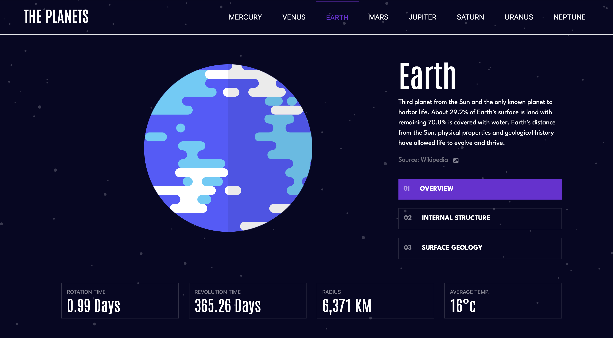
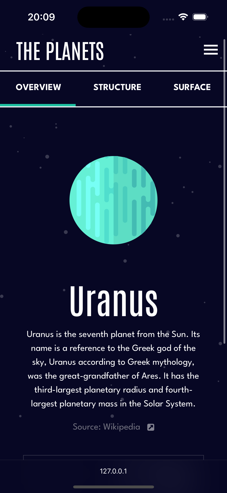

A dynamic and informative website, the site offers a captivating tour of the planets in our solar system, featuring a summary of each one. Developed using the latest front-end technologies, including:

- Next.js
- React
- TypeScript
- TailwindCSS
  

The use of these technologies ensures a user-friendly interface and a responsive design, which adapts seamlessly to different screen sizes, providing a pleasant browsing experience on both mobile devices and desktops. Each planet is presented with concise yet rich information, allowing site visitors to quickly learn about the unique characteristics of each one.

<a href="https://astronomy-sand.vercel.app">See on your own device</a>

</img>

</img>
